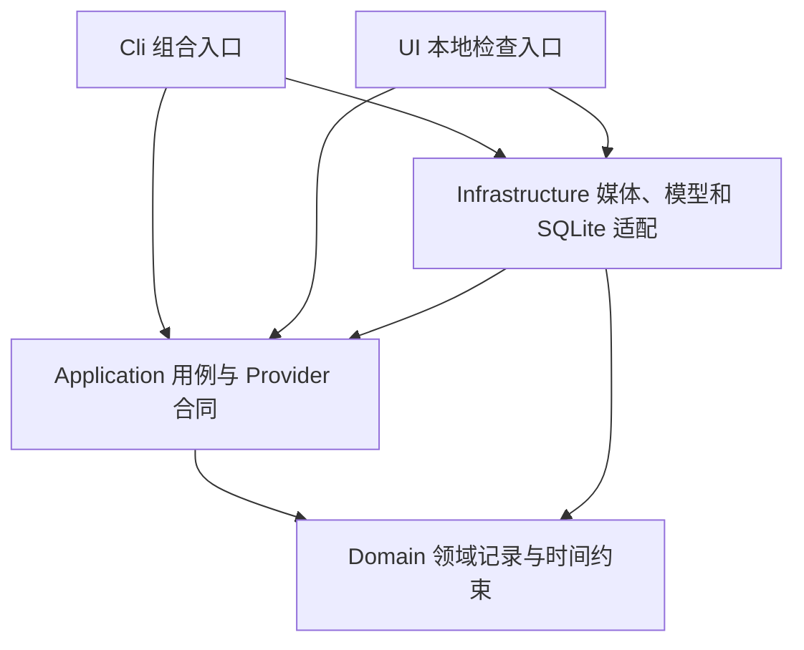

# Phase 0 架构基线 v2

工作台检索诊断由纯Application `retrieval_diagnostics`投影已有InspectionView；UI/service附加十个固定位置，静态页面负责显示、当前查询身份核对、下载和原区间预览。投影不重排、不调用模型、不评分，检索保存仍走已有execute_search。没有人工标签时质量字段为空；正式计分继续由benchmark处理。使用步骤见[检索诊断指南](../references/retrieval-diagnostics-guide.md)。

静态页面提供临时“前后各1秒回看”：根据当前有效行与已校验media.durationUs计算源时钟范围，复用源视频seek／结束暂停，不生成新Candidate或修改行对象。原区间播放、选片篮／导出与证据引用保持；拖动时间条释放临时停止点，切项目／run或丢失选择时禁用。回看显示实际范围，仅本地媒体读取，无新API／Provider／检索记录。

状态：2026-10-03 实施基线，按用户解除语言限制的补充采用 Python；性能和检索质量仍待实测。依据原方案 §15–20、49–56、69–71；详见 [语言决策](./adr-001-phase-0-language.md)、[审查报告](../exec-plans/reverse-review-2026-10-03.md) 与 [工程合同](./phase-0-engineering-spec.md)。

## 包结构与依赖

跨素材检索通过Application `search_timelines`把明确选择的Completed来源合为联合语料，复用原BM25／E5／RRF内核。内部文档按runId区分、候选仍用原run／原文档身份；去重先核对media，来源SHA重复拒绝。CLI `search-project`只读核验SQLite，再组合本地embedding；新Infrastructure `project_search_files`发布独立版本结果及最后SHA回执，不扩展SQL、不改旧单run检索或benchmark。公开脚本与边界见[联合检索指南](../references/project-retrieval-guide.md)。

多素材离线准备由纯Application `media_batch`顺序复用`prepare_media`、原MediaProcessor／TimelineStore；CLI只组合FFmpeg与SQLite。Infrastructure `media_batch_files`在项目内冻结原输入／配置、预先分配的runId和SHA回执，批次状态原子替换、进程锁排除并发写；没有新SQL／HTTP／Provider合同。续跑先查固定任务，Pending且media完成则读回核验不改任务，media-only中断才续准备，任何非media阶段或调用只报告现状。单项输入失败继续，存储／环境问题或取消停止；不构造模型／账本。详见[批次指南](../references/media-batch-preparation-guide.md)。

包为 `src/gamingcreator/{cli,application,domain,infrastructure}/`，测试在 `tests/test_*.py`。F001 固定 CPython 3.13.16/build 20261001、uv 0.12.22 与开发依赖，建立 pytest/Ruff/严格 mypy/导入检查。F002 实现媒体 port、整数 PTS/有理数源时钟、图片与分段 WAV 映射及 Windows Job 进程树管理。F004 实现 TimelineStore、sqlite3 单线程/进程锁、迁移/组合 FK、checkpoint/账本与完整性恢复。F003/F005 已接本地 ASR、视觉 Provider、账本和本地混合检索，不拆服务或多语言核心。

CLI 只解析输入、组装依赖和输出结果；Application 编排 stages、定义 Protocol ports；Domain 用类型化领域记录，无厂商 SDK、SQL 或进程调用；Infrastructure 实现 ports。正式桌面界面以后另作选型；通过 Application 或版本化 CLI/JSON 接入处理核心。

`ui/` 是第二个组合入口，提供本地标准库 HTTP 服务和打包的静态页面，共用 Application 检索与 SQLite ports。`/api/projects`、`runs`、`inspect` 读取已有运行；`media`、`evidence` 仅按注册身份提供经 hash 校验的文件和单段 Range/HEAD。单条证据读取不重扫源视频；文件身份变化使校验缓存失效。空查询不执行搜索，非空查询仍保存既有检索记录。页面选片只在浏览器按项目/run 保存，导出前重验当前区间，不写人工标签。详见 [ADR-002](./adr-002-local-inspection-ui.md) 与 [API 合同](./inspection-workspace-api.md)。

本地页面不代表纯云服务，桌面EXE也不代表全离线推理；当前视频/ASR/SQLite/E5在本机，视觉证据必要图片发DeepSeek。未来Windows桌面封装遵循原本地优先方向，完整云端托管则需另作存储、任务与账号边界设计。详见[部署路线](../references/deployment-roadmap.md)。

主体细节是独立精分析 sidecar，不重写基础事件。`/api/inspect` 显式选择 v1/v2/v3/v4 并返回条件词表与已保存结果身份；`POST /api/match-details` 只读匹配用户确认的同主体/同部件 AND 条件，页面按当前 request/payload 身份接收结果。`POST /api/draft-detail-query` 使用纯Application有限语法把描述变成可编辑清单，保留全部原文与未处理要求；不读项目或调用模型，未完整理解时须明确确认子集，不能替代自由查询的整句语义。`GET /api/detail-cost-history` 只读独立精分析的 planned/result/预算记录，显示本 run 与全项目已知估价及未知预留，不执行恢复、结算或模型调用。v3 将一个实际部件的属性嵌套后验证，再投影到冻结领域结构；v4保存连续实体、遮挡和持有关系证据，两者尚无真实模型验证。自由查询仍走原检索，不能据候选局部条件宣称整句满足。细节合同与版本边界见 [主体细节规格](./actor-detail-matching-spec.md) 和 [API 合同](./inspection-workspace-api.md)。

已登记人工反馈由纯Application解码、原报告候选来源验证和精确结果投影组成；Infrastructure只读项目内独立 `detail-description-feedback` 文件，UI在描述及条件结果旁显示原话。报告原始SHA、case/run/event/request/payload及shot/actor须一致，更换模型结果不继承确认。反馈仅针对描述，不重写事实、属性、匹配结果或U10；不存在记录为未核对，损坏记录明确报错。

## 数据流与状态

F006候选评审使用纯Application benchmark_review把绑定manifest、报告与保存检索组成固定十位依据；默认核对人工记录后转换candidateLabels及reviewed，不计分或改原声明。显式Score由benchmark_review_scoring注入原保存hits／原失败，复用原run_benchmark算法，不重新检索；benchmark_analysis_costs纯汇总原attempt，与CLI同用。费用unknown保持，原检索时间与评分时间分开，记录原SHA／retrievalId。UI renderer打包离线HTML／静态JS，file原片回看、下载／载入记录；hash限定脚本、connect-src none，无新增HTTP路由。scripts/prepare-benchmark-review.py组合只读TimelineStore，Infrastructure新目录独占发布并最后写SHA回执；不操作模型或账本，失败／未验证评分退出6保留报告。原benchmark命令仍显式再检索，旧无身份报告拒绝评审准备。见[候选评审指南](../references/benchmark-candidate-review-guide.md)。

F006验收准备由纯Application benchmark_preparation验证计划／分区／同源与查询族、参考和旧benchmark转换；Infrastructure benchmark_preparation_files有界读取、SHA回执和新目录独占发布；CLI组合本地MediaProcessor.probe与只读TimelineStore。先冻结原输入／录像SHA与时长／UTC时间，再绑定Completed run并保留原config／pipeline来源。冻结与绑定无Provider／预算／检索，候选标签空；benchmark --binding先核对只增候选评分／复核，不允许更换查询／参考／身份。缺独立性与人评继续null，资料准备不代替F006。

离线对照生成器从冻结proposal、原报告/人工反馈和当前精确版本侧车读取同候选资料，复核注册帧、原结果和旧匹配逐项一致；输出新目录内的HTML、来源JSON及默认空值的人工记录模板。画面与下载JSON内嵌静态页面，无脚本/外部连接；不存在v4结果就保留no_saved_result，不调用Provider、预留预算或写源数据库。详情见[使用指南](../references/detail-pilot-comparison-guide.md)。

人工记录由Application纯解码和来源绑定，UI生成独立本地表单（hash限定脚本CSP、无外部连接），Infrastructure有界读取并独占写新记录目录。script先重跑原对照的来源核对，再验证四维bool/null、元数据、原帧和当前scene实体；缺结果不可判断。归档保留原输入字节、规范记录、完整comparison、汇总和摘要，不写模型侧车或U10标签。见[记录指南](../references/detail-pilot-review-guide.md)。

v4精分析新增独立实体连续性证据：注册帧及源时钟→角色/物品/未知分类、逐帧可见性、相邻边界及持有关系→temporal-scene-v1→确定性actor投影→原词表的AND匹配。actor-details-v2将scene与投影共同保存；Application每次序列化、恢复、读取和匹配比较重新计算的投影，合法scene不能配合伪造的actor属性。unknown边界不连接身份，不确定实体/持有关系阻止全局no_match。新schema-v2/matcher-v2及v4请求哈希隔离旧数据，旧payload不新增null字段；v4沿用原单次HTTP、费用和取消路径，仍需真实模型验证。

本地源文件 → hash/probe → 带 PTS 的视觉证据＋音频 → 本地 ASR＋视觉 Provider → 校验后的 SemanticEvent → SQLite → 检索/重排/去重 → CandidateClip。

阶段：`Probe → Evidence → ASR → Vision → Persist → Index`；状态 `Pending/Running/Completed/Failed/Cancelled/Interrupted`。无音轨/无语音是 ASR 的显式结果，不是异常终止。只从完整可用 run 搜索；每项目同时只允许一个分析写入者。

证据与校验后的语义结果保存在本地项目工作目录；不保存视觉模型原响应。SQLite存路径、hash、版本、checkpoint和调用账本，失败仅保留白名单结构诊断。源视频保持原位。先完成临时文件写入并校验，再短事务登记；恢复时核对文件与数据库。任何模型或FFmpeg调用均不持有数据库写事务。

## 模型与检索边界

首个视觉实验使用 DeepSeek `deepseek-flash` 图像序列；本地 ASR 实现与替换对照属于 F003。`VisionProvider`、`AsrProvider`、`EmbeddingProvider` 对应原方案接口职责；查询扩展/重排用 `LlmProvider`。Provider 声明输入能力和实际模型修订，不能只声明“OpenAI 兼容”。网络异步；原生 ASR 在可终止 worker 执行，不阻塞事件循环。

先建立可解释词法检索基线，再比较语义扩展/embedding 与重排方案；embedding 用量、维数和版本独立记录。检索只输出有源证据的片段，不把叙述模型的自由文本直接当确定机制。强模型升级率是实验参数，不固定为 10%。

## 架构检查

F001 建立包导入方向、类型和格式检查；F004 检查 SQLite 与文件原子边界、断点恢复；F003 检查 Provider 替换和未知 usage；F005 检查时间码、稳定排序和重复事件；F006 执行独立 benchmark。架构基线可据失败证据修订，修订保留原因、影响与版本。
