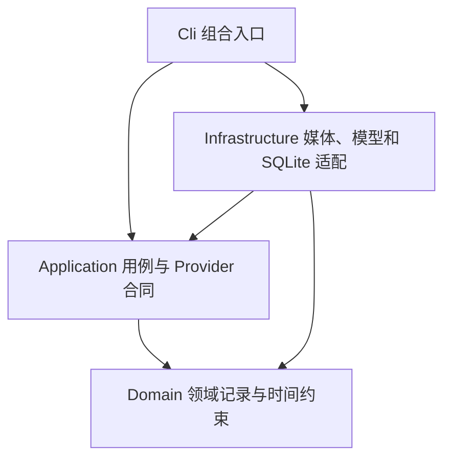

# Phase 0 架构基线 v2

状态：2026-10-03 实施基线，按用户解除语言限制的补充采用 Python；性能和检索质量仍待实测。依据原方案 §15–20、49–56、69–71；详见 [语言决策](./adr-001-phase-0-language.md)、[审查报告](../exec-plans/reverse-review-2026-10-03.md) 与 [工程合同](./phase-0-engineering-spec.md)。

## 包结构与依赖

初始包为 `src/gamingcreator/{cli,application,domain,infrastructure}/`，测试镜像组织。CPython 3.13 与 portable uv/`.venv` 为环境基线；F001 固定补丁、工具与依赖版本，建立 pytest、Ruff、mypy 和导入方向检查。Media、ASR、Vision、Timeline、Retrieval 作内部模块；先维持一个可安装的包，不提前拆服务或多语言核心。

CLI 只解析输入、组装依赖和输出结果；Application 编排 stages、定义 Protocol ports；Domain 用类型化领域记录，无厂商 SDK、SQL 或进程调用；Infrastructure 实现 ports。正式桌面界面以后另作选型；通过 Application 或版本化 CLI/JSON 接入处理核心。

## 数据流与状态

本地源文件 → hash/probe → 带 PTS 的视觉证据＋音频 → 本地 ASR＋视觉 Provider → 校验后的 SemanticEvent → SQLite → 检索/重排/去重 → CandidateClip。

阶段：`Probe → Evidence → ASR → Vision → Persist → Index`；状态 `Pending/Running/Completed/Failed/Cancelled/Interrupted`。无音轨/无语音是 ASR 的显式结果，不是异常终止。只从完整可用 run 搜索；每项目同时只允许一个分析写入者。

证据和原始响应保存在本地项目工作目录；SQLite 存路径、hash、语义结果、版本、checkpoint 和调用账本。源视频保持原位。先完成临时文件写入并校验，再短事务登记；恢复时核对文件与数据库。任何模型或 FFmpeg 调用均不持有数据库写事务。

## 模型与检索边界

首个视觉实验使用 DeepSeek `deepseek-flash` 图像序列；本地 ASR 实现与替换对照属于 F003。`VisionProvider`、`AsrProvider`、`EmbeddingProvider` 对应原方案接口职责；查询扩展/重排用 `LlmProvider`。Provider 声明输入能力和实际模型修订，不能只声明“OpenAI 兼容”。网络异步；原生 ASR 在可终止 worker 执行，不阻塞事件循环。

先建立可解释词法检索基线，再比较语义扩展/embedding 与重排方案；embedding 用量、维数和版本独立记录。检索只输出有源证据的片段，不把叙述模型的自由文本直接当确定机制。强模型升级率是实验参数，不固定为 10%。

## 架构检查

F001 建立包导入方向、类型和格式检查；F004 检查 SQLite 与文件原子边界、断点恢复；F003 检查 Provider 替换和未知 usage；F005 检查时间码、稳定排序和重复事件；F006 执行独立 benchmark。架构基线可据失败证据修订，修订保留原因、影响与版本。
