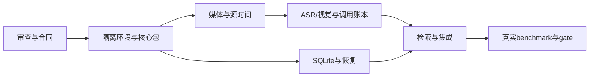

# Phase 0 开发任务与依赖

依据 [反向审查](./reverse-review-2026-10-03.md)、[工程合同](../design-docs/phase-0-engineering-spec.md) 和原方案 §71。保持 F001–F006 ID，避免其他工具交接时重复创建特性。以下任务尚未实现；spike 仅为 F000 的证据。

| 特性 | 交付与文件归属 | 验证与依赖 |
| --- | --- | --- |
| F001 | `.tools` 隔离安装脚本/版本清单、pyproject.toml/uv.lock/.python-version、`src/gamingcreator` 四层包、DTO/Protocol、pytest/Ruff/mypy/导入检查 | 前提 F000。仅项目 uv/Python/venv 构建；无 Windows 注册/全局链接；输入错误码、类型与导入方向检查；锁版本，禁止系统 Python 兜底 |
| F002 | `infrastructure/media`、Evidence/时间映射、`tests/media` | 前提 F001。真实素材＋合成 VFR、非零 PTS、无音轨、坏文件、路径中文空格；取消退出与源时间可追溯，不能只测帧序号 |
| F003 | `infrastructure/providers`、`.venv` ASR/worker、prompts、`tests/providers` | 前提 F002。先 DeepSeek视觉＋一个本地ASR；静音/词表；JSON/schema/usage/预算/重试；第二Provider或合同替换验证，不伪造真实质量 |
| F004 | `infrastructure/storage`、SQL迁移、`tests/storage`；消费 F001 ports | 前提 F001；可与媒体/模型适配并行。run/checkpoint/证据/账本、FK/事务、文件丢失、进程中断与恢复，恢复保留未知费用 |
| F005 | `application/retrieval`、检索适配、`tests/retrieval`、CLI组合更新 | 前提 F003＋F004。固定run检索、词法与语义方案对照、去重/排序/证据/源时间；无片段合法、相同配置可复现 |
| F006 | benchmark执行器/人工标签清单、`tests/benchmark`、go/no-go报告 | 前提 F005；标签准备可先行。主组逐查询≥70%、少例/负例、独立测试集、时间误差、冷/热成本与长素材速度；不达标保留未通过 |

语言决策遵循 [ADR-001](../design-docs/adr-001-phase-0-language.md)：Phase 0 Python，未来 UI 另作选型。F003 内部可将 ASR 与视觉拆为两项 owner，前提 DTO 已集成并分别拥有文件。公共 domain/ports 由 F001 owner 集中落地；其他 Agent 不同时改共享接口。pyproject/uv.lock 的跨特性依赖变更由集成负责人串行更新。每个编码会话使用独立 branch/worktree，在 `assignments.md` 分配后开始；根 HANDOFF/progress/feature_list 由集成负责人汇总。

人工标签准备：先在用户提供的三个短视频上形成开发事件表和查询，核对事件是否确实可见；收集小时级录像与 10–20 代表录制会话，再冻结最终主组。两段 Atom 先视为同源；测试集不能用模型生成标签代替人工。

执行先后：F001 确认项目环境与合同编译；媒体／存储并行；随后模型／存储集成；检索；最后真实 gate。每个任务用 `sprint-template.md` 记录 owner、分支、验证和转交动作。正式 UI、Creative Planner、Rendering 与商业系统在原定质量门槛通过之后另立阶段任务。
