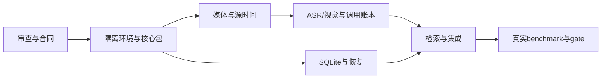

# Phase 0 开发任务与依赖

依据 [反向审查](./reverse-review-2026-10-03.md)、[工程合同](../design-docs/phase-0-engineering-spec.md) 和原方案 §71。保持 F001–F006 ID，避免交接时重复创建特性。F001–F005 的技术合同已验收，CLI Demo实测见 [sprint-demo](./sprint-demo.md)。F006工具已实现，独立人工质量gate仍未通过；旧spike仅为F000证据。

2026-10-08当前里程碑：[分组词法／语义排名](sprint-saved-detail-grouped-ranking.md)已现用／abbba14普通push；18新增通过，旧完整六项非通过归TD012／TD014，真实复合仍partial、1/227。[两冻结候选真实试验](sprint-detail-temporal-execution.md)获授权后各一次／六帧，两次HTTP400，无新结果、不重试。用户已核实未扣费，确认另存；原API未知记录及保守占用、更早另一任务unknown保持。902旧文件／28外部保护及独立读回通过。下一root离线核对请求格式并准备版本化修正，不改原冻结提案或自动补发。正式F006独立录像／事前参考／固定评分仍待真人，入口时点见[人工待办](human-inputs.md)，日常不用填表。F006/F009/F010false，继续Phase 0；旧里程碑为历史，不覆盖当前事实。

| 特性 | 交付与文件归属 | 验证与依赖 |
| --- | --- | --- |
| F001 | `.tools` 隔离安装脚本/版本清单、pyproject.toml/uv.lock/.python-version、`src/gamingcreator` 四层包、DTO/Protocol、pytest/Ruff/mypy/导入检查 | 前提 F000。仅项目 uv/Python/venv 构建；无 Windows 注册/全局链接；输入错误码、类型与导入方向检查；锁版本，禁止系统 Python 兜底 |
| F002 | `infrastructure/media`、Evidence/时间映射、`tests/media` | 前提 F001。真实素材＋合成 VFR、非零 PTS、无音轨、坏文件、路径中文空格；取消退出与源时间可追溯，不能只测帧序号 |
| F003 | `infrastructure/providers`、`.venv` ASR/worker、prompts、`tests/providers` | 前提 F002。先 DeepSeek视觉＋一个本地ASR；静音/词表；JSON/schema/usage/预算/重试；第二Provider或合同替换验证，不伪造真实质量 |
| F004 | `infrastructure/storage`、SQL迁移、`tests/storage`；消费 F001 ports | 前提 F001；可与媒体/模型适配并行。run/checkpoint/证据/账本、FK/事务、文件丢失、进程中断与恢复，恢复保留未知费用 |
| F005 | `application/retrieval`、检索适配、`tests/retrieval`、CLI组合更新 | 前提 F003＋F004。固定run检索、词法与语义方案对照、去重/排序/证据/源时间；无片段合法、相同配置可复现 |
| F006 | benchmark执行器/人工标签清单、`tests/benchmark`、go/no-go报告 | 前提 F005；标签准备可先行。主组逐查询≥70%、少例/负例、独立测试集、时间误差、冷/热成本与长素材速度；不达标保留未通过 |

语言决策遵循 [ADR-001](../design-docs/adr-001-phase-0-language.md)：Phase 0 Python，未来正式桌面 UI 另作选型。2026-10-04 用户授权的 F007 本地检查工作台按 [ADR-002](../design-docs/adr-002-local-inspection-ui.md) 复用 Python 和零依赖静态页面，技术验收见 [sprint-inspection-workspace](./sprint-inspection-workspace.md)；它不改变 F006。F003 内部可将 ASR 与视觉拆为两项 owner，前提 DTO 已集成并分别拥有文件。公共 domain/ports 由 F001 owner 集中落地；其他 Agent 不同时改共享接口。pyproject/uv.lock 的跨特性依赖变更由集成负责人串行更新。每个编码会话使用独立 branch/worktree，在 `assignments.md` 分配后开始；根 HANDOFF/progress/feature_list 由集成负责人汇总。

人工标签准备：先在用户素材上形成开发事件表和查询，人工核对可见性；收集小时级录像与10–20代表会话后冻结主组。F000仅测三段；F002已完整处理额外275.831s Atom录像在内的四段，但不证明模型质量。同录制来源先放同组；模型标签不能代替独立人工标签。

执行先后：F001 确认项目环境与合同编译；媒体／存储并行；随后模型／存储集成；检索；最后真实 gate。每个任务用 `sprint-template.md` 记录 owner、分支、验证和转交动作。正式 UI、Creative Planner、Rendering 与商业系统在原定质量门槛通过之后另立阶段任务。

用户反馈后的当前纠正任务是F009连续动作与F010主体细节；已有V6分析Demo并不解除F006。接续按[sprint-actor-detail-matching](./sprint-actor-detail-matching.md)：先冻结主体/部件/证据合同和纯AND匹配，随后Application ports，再并行Provider/共享预算与sidecar持久化，最后由root接CLI/UI并做两候选有界试验。自由文本检索不自动得到严格复合保证，默认查询仍离线；具体归属、实现状态和检查点以HANDOFF及assignments为准。

2026-10-06用户要求主线交付优先，非阻断小bug归档后继续阶段任务，见agent-workflow。当前离线主线补齐F005／F006的长录像检索规模与全链路验证，见[sprint-long-footage-retrieval](./sprint-long-footage-retrieval.md)；F009/F010真实理解门槛及待授权调用保持未通过。按总方案推进，不用诊断微修替代阶段功能，也不越过原独立质量gate进入正式桌面／商业阶段。
